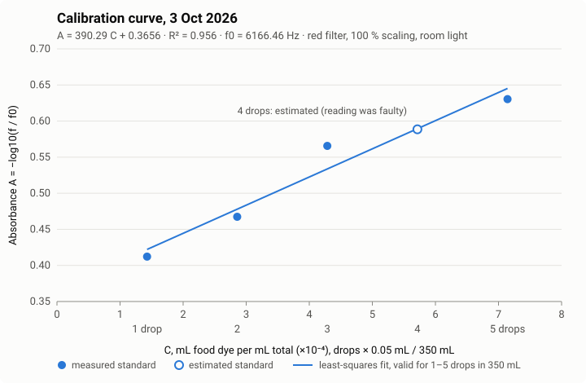

# Nuclear Challenge: Reactor Stability Control (Dye Analogue)

A bench-scale analogue of reactor control for the 2026 Nuclear Innovation Challenge (Controls and Instrumentation track). Green food dye stands in for boron: adding dye "lowers the control rods", diluting with clear water "raises" them. A colour sensor reads the dye concentration, and pumps hold it at a target. The long-term goal is a holistic system that predicts unstable conditions and recommends actions before they happen.

Built on the challenge's base code: [IdeasClinicUWaterloo/F26-NuclearIC](https://github.com/IdeasClinicUWaterloo/F26-NuclearIC)

Canva view link: https://canva.link/ud9t2yi2hbv6vku

Google docs view link: https://docs.google.com/document/d/1-GoW5N-BXc-cunrPMzWbaOq6qewn9IFudRMmZFtr4vw/edit?usp=sharing

## Contents

| Folder | What it is |
| --- | --- |
| `Pump Control App/Pump Control.html` | Desktop control app. Open in Chrome or Edge, no install. Connects to the Arduino over USB (Web Serial). |
| `Pump Control App/pump_control_serial/` | Arduino sketch the app talks to: pumps, colour sensor, stored calibration, safety limits. |
| `Beaker Level Camera/Beaker Level Camera.html` | Standalone page that measures the tank level in mL from a phone used as a webcam. No Arduino needed. |
| `BeerLambertCalibrator/` | The repo's calibration sketch, extended to print live concentration and hold a saved calibration. Used from the Serial Monitor. |
| `dye_concentration_controller/` | The repo's controller sketch with a 10-second-per-pump test mode added, plus a local copy of the PID library (Brett Beauregard, MIT licence) so it compiles without installing it. |
| `Docs/Nuclear Innovation Challenge.pptx` | Group 9's presentation: challenge problem, background, the control rod simulator, experiment and observations, setbacks, safety and regulations, citations and AI disclosure. |
| `Docs/calibration-2026-10-03.svg` | Graph of the 3 Oct 2026 calibration: absorbance of the five standards against concentration, with the fitted line. |

## Hardware

Arduino UNO R4 Minima, SEN0101 (TCS3200) colour sensor, three 3 V pumps (dye, clear, waste) on two DRV8833 drivers powered by a 9 V battery, 500 mL control tank run at 350 mL (limit 450 mL). Pins follow `WIRING.md` in the base repo:

- Pumps: dye D3/D5, clear D6/D9, waste D10/D11 (PWM pin / held LOW)
- Sensor: OUT D2, S0 D4, S1 D7, S2 D8, S3 D12, OE to GND
- Sensor read through the red filter at 100 % scaling (green dye absorbs red); ambient room lighting

## Running it

1. Upload `pump_control_serial.ino` from the Arduino IDE (board: Arduino UNO R4 Minima). Close the Serial Monitor afterwards.
2. Open `Pump Control.html` in Chrome or Edge, click **Connect to Arduino**, pick the board's COM port.
3. Enter the real tank level under **Actual level** and click **Set** before running pumps.

### App features

- Manual pump control: speed 56-80 (of 255) in steps of 2, timed runs with volume estimates, Stop all (Esc / Space).
- Live dye concentration, raw colour channels and a 10-minute trend graph.
- Calibration wizard (known concentrations, measured absorbance, fitted curve), saved to the Arduino's EEPROM.
- Automatic concentration control: doses dye or clear water in bursts at the selected speeds, waits for mixing, re-reads, repeats until within tolerance. Flushes after a set volume or before the tank could overflow.

## Beaker level camera

`Beaker Level Camera.html` reads the water level in the tank from a phone camera. Open it in Chrome or Edge; it runs on its own and does not connect to the Arduino.

1. Install a webcam app (Camo, Iriun or DroidCam) on the phone and laptop so the phone shows up as a camera, then pick it and click **Start camera**.
2. Fix the phone side-on to the beaker with the liquid line in view. It must not move afterwards.
3. Click **Mark A** and then a known level on the beaker (for example 350 mL), and do the same for **Mark B** at a second level (for example 450 mL).
4. Slide the measuring strip onto a clear part of the beaker, away from labels and tape. A striped card behind the beaker helps with clear water.

How it works: in a narrow vertical strip, each row's median colour is compared with the rows above and below it, and the strongest change is taken as the water surface. It can look for green dye, for any brightness edge (clear or faint water), or pick whichever is clearer automatically. Near-white LED glare is ignored. The two marks map image height to mL, assuming a straight-sided beaker. The reading is the median of the last 9 frames, and it is only marked as trusted when the line is strong, well above the strip's normal variation, steady to within 20 mL, and the picture is not frozen. Other code on the same page can use `window.levelTrusted()`, `window.levelWhy()` and the `beakerlevel` event (about 4 readings a second).

## Calibration

- Known concentration: `C = (drops x 0.05 mL) / 350 mL` (mL food dye / mL total)
- Measured absorbance: `A = -log10(f / f0)`, with `f0` the clear-water frequency
- Calibration curve: straight line `A = slope x C + intercept` (A on y, C on x), read the other way round for unknowns: `C = beta0 + beta1 x A`

Current default (3 Oct 2026, 4th standard estimated because its reading was faulty): `f0 = 6166.46 Hz`, `A = 390.29 C + 0.3656`, R² = 0.956, valid for 1-5 drops in 350 mL.

| Drops | C (mL/mL) | f (Hz) | A |
| --- | --- | --- | --- |
| 1 | 0.000143 | 2386.79 | 0.4122 |
| 2 | 0.000286 | 2102.23 | 0.4674 |
| 3 | 0.000429 | 1676.50 | 0.5656 |
| 4 | 0.000571 | 1590.16 (estimated) | 0.5886 |
| 5 | 0.000714 | 1444.28 | 0.6304 |

## Measured pump flow (speed 60)

| Pump | Flow |
| --- | --- |
| Dye | 8.9 mL/s |
| Clear | 7.95 mL/s |
| Waste (flush) | 9.4 mL/s |

Runs vary by about ±10 mL, so volumes in the app are estimates.

## Safety built in

- Arduino: pumps start off; speed limited to 0 or 55-80; each run capped so one burst cannot overflow the tank; all pumps stop within 3 s if the app goes quiet.
- App: estimated tank level guards (stops inflow near 450 mL, waste at 100 mL); automatic control stops on sensor fault, Arduino safety stop, disconnect or Stop all.
- The pump app does not read a level sensor yet (the beaker level camera runs separately): always watch the tank.

